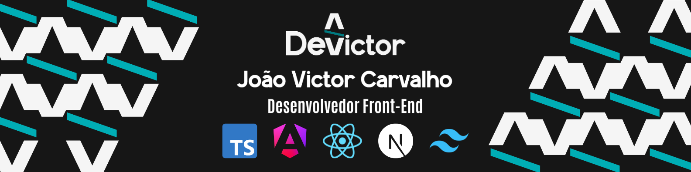

  

  

    
  

  
   
  
  

---

### 💻 Sobre Mim

Desenvolvedor Front-End formado em **Análise e Desenvolvimento de Sistemas (UNIP)**, especializado em aplicações **B2B**, arquitetura baseada em componentes e otimização de performance visual.

- 🚀 **Especialidades:** Construção de sistemas escaláveis com **TypeScript, Angular, React.js, Next.js, Tailwind CSS e Sass**.
- 🛠️ **Foco em Qualidade:** Experiência com gerenciamento de estado, consumo de APIs RESTful e acessibilidade web (**WCAG 2.2 / ARIA**).
- ⚙️ **Processos:** Atuação em squads ágeis (Scrum), suporte direto a times de QA e esteiras de integração contínua (GitLab CI/GitHub Actions).

---

### 🛠️ Stack Técnica & Ferramentas

| Categoria | Tecnologias |
| :--- | :--- |
| **Linguagens & Core** |     |
| **Frameworks & Libs** |     |
| **Estilização & UI** |    |
| **Testes & Qualidade** |   |
| **DevOps & Tooling** |     |

---

### 📈 Estatísticas

  
  

