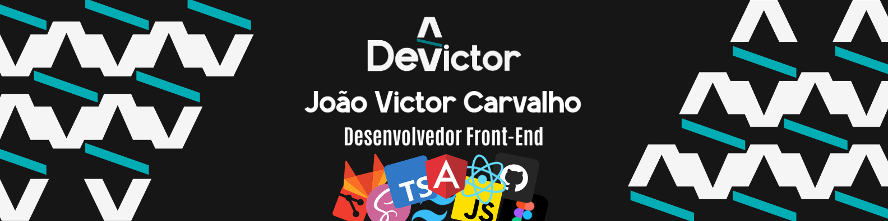

  

<h1 align="center">Olá, eu sou o João Victor! 👋</h1>

  

    
  

   
  

---

### 💬 Sobre mim

Desenvolvedor Front-end com sólida experiência em arquitetura baseada em componentes utilizando Angular, TypeScript e Tailwind CSS. Foco na engenharia de plataformas B2B e sistemas transacionais legados, unindo escalabilidade de código, resolução de gargalos de performance e manipulação de dados em larga escala. Histórico comprovado de entregas com impacto financeiro direto e colaboração ágil com times de qualidade técnica.

---

### 🛠️ Tecnologias & Ferramentas

  
  
  
  
  
  
  
  
  
  

---

### 📈 Estatísticas

  
  

